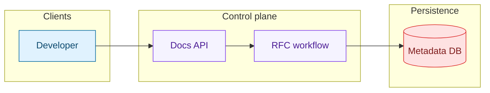
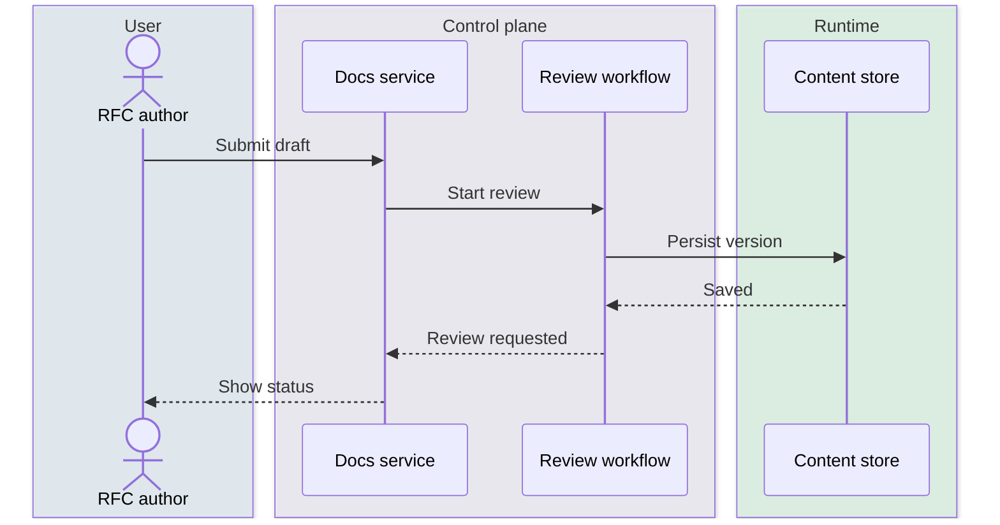

Use this skill for any Mermaid work in technical writing.

## When to use it

- Writing or editing Mermaid in `README.md`, design docs, RFCs, ADRs, runbooks, or onboarding notes
- Turning prose architecture into a diagram
- Choosing between flowchart, sequence, state, ER, timeline, or gantt
- Adding semantic colors, subgraphs, lanes, and grouping
- Validating Mermaid before shipping docs

## Default workflow

1. Identify the doc's purpose: overview, interaction, lifecycle, data model, rollout plan, or chronology.
2. Pick the simplest diagram type that communicates that purpose.
3. Draft the smallest correct diagram first.
4. Add semantic grouping with subgraphs / boxes / sections.
5. Add a restrained color palette only after the structure is correct.
6. Validate the exact file you changed.
7. If validation is unavailable, keep syntax conservative and call out that rendering was not verified locally.

## Diagram chooser

- `flowchart` / `graph` — architecture overview, process flow, request pipeline, ownership boundaries
- `sequenceDiagram` — time-ordered service interactions or control flow
- `stateDiagram-v2` — lifecycle/state machine
- `classDiagram` — domain model, interfaces, component relationships
- `erDiagram` — tables/entities and cardinality
- `timeline` — chronology or milestone history
- `gantt` — execution plan, migration plan, rollout schedule
- `mindmap` — scope decomposition or brainstorming
- `journey` — end-user workflow scoring
- `gitGraph` — release flow or branch strategy

## Semantic color guidance

Prefer one consistent palette across the document:

- users / external actors: blue
- authoring or control plane: purple
- runtime / compute / workers: green
- networking / edge / ingress: orange
- data stores / queues / persistence: red
- storage / artifacts / object stores: yellow
- observability / policy / meta systems: gray
- success states: green
- warning / pending states: amber
- failure states: red

Use reusable styles instead of one-off colors wherever possible.

### Flowchart pattern



### Sequence pattern



## Mermaid gotchas

- Every Mermaid block starts with a diagram type declaration.
- Prefer quoted labels when they contain punctuation.
- Avoid lowercase `end` as an unquoted label.
- In flowcharts, `linkStyle` indexes edges by declaration order.
- Keep the first draft minimal, then style.
- Validate after edits because small typos can break the whole diagram.

## Validation

Always validate Mermaid if `mmdc` is available.

Run the bundled validator from the skill directory:

```bash
node ./scripts/validate-mermaid.js path/to/file.md
node ./scripts/validate-mermaid.js path/to/diagram.mmd
node ./scripts/validate-mermaid.js docs/
node ./scripts/validate-mermaid.js --self-test-styles
```

The validator:
- extracts Mermaid fences from Markdown and MDX
- validates standalone `.mmd` and `.mermaid` files
- reports failing block numbers and approximate source lines
- can self-test styled flowchart, sequence, class, state, and ER examples

## Optional scaffolding helper

Use the template generator when you want a fast, styled starting point:

```bash
node ./scripts/new-mermaid-template.js flowchart
node ./scripts/new-mermaid-template.js sequence --title "RFC review lifecycle"
```

## Finishing rule

Before finalizing Mermaid changes:

1. save the file
2. validate the changed file(s)
3. fix any parse issues
4. re-run validation
5. only then return the final diagram or patch

## References

Read these as needed:
- `references/diagram-types.md` — small working examples for major Mermaid diagram types
- `references/rfc-diagram-patterns.md` — doc/RFC-friendly patterns with colors, groups, and recommended use cases
- `references/official-sources.md` — official Mermaid docs and validation notes
