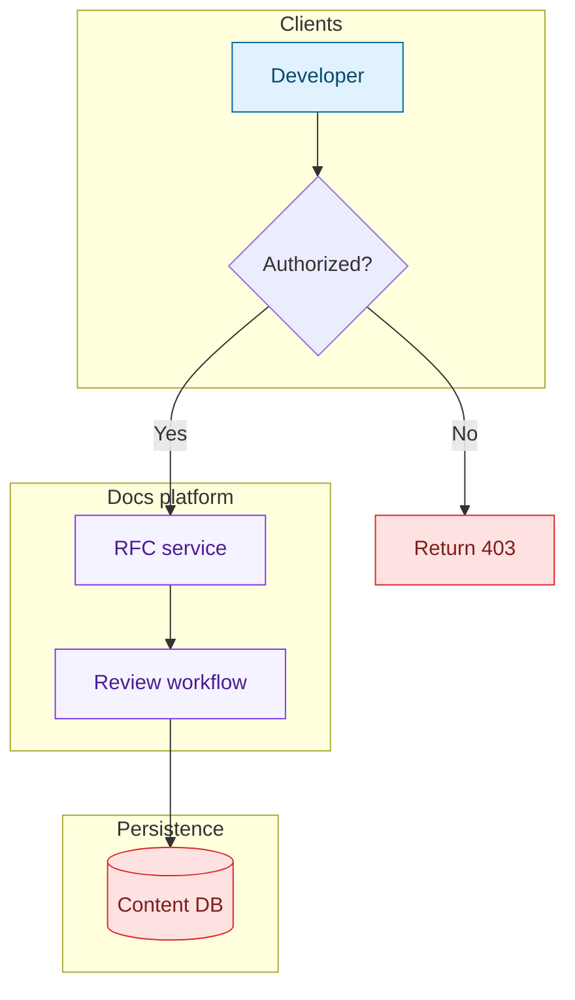
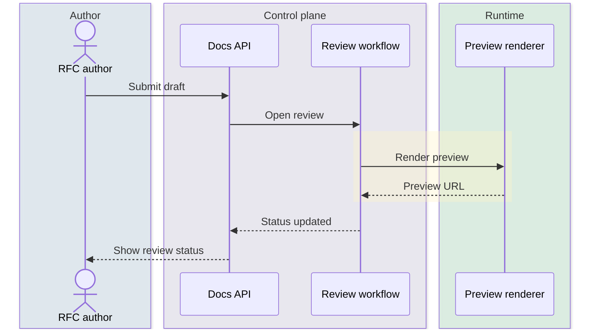
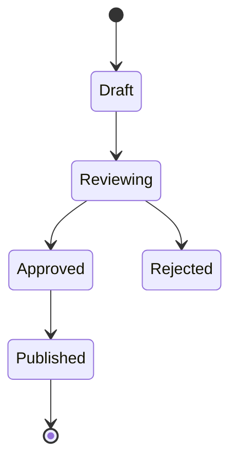
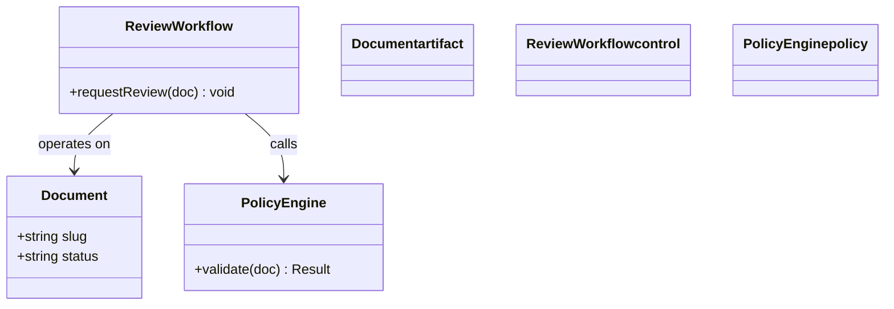
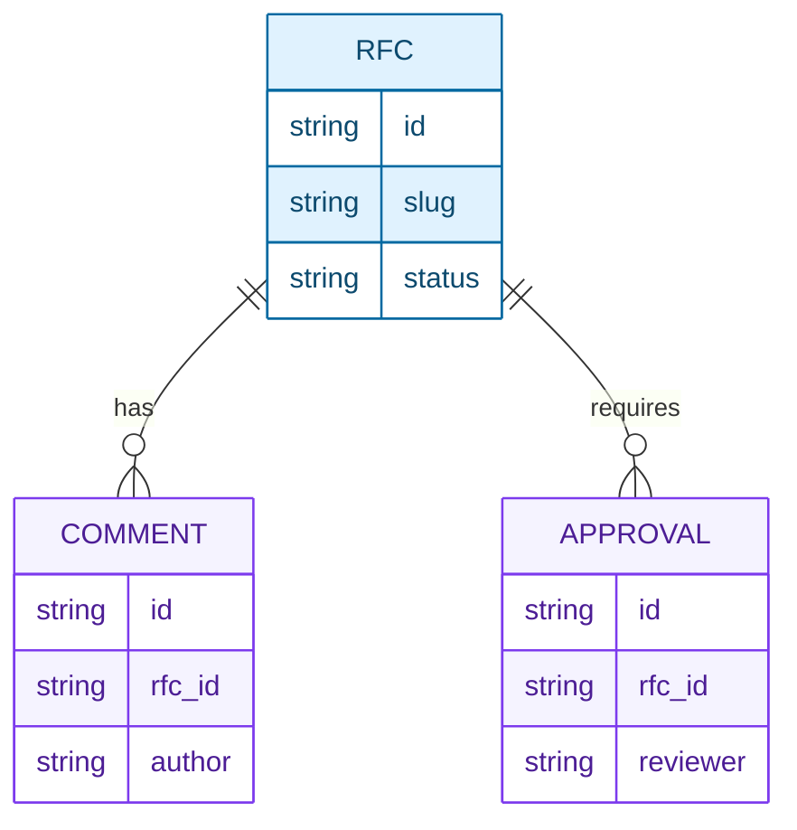
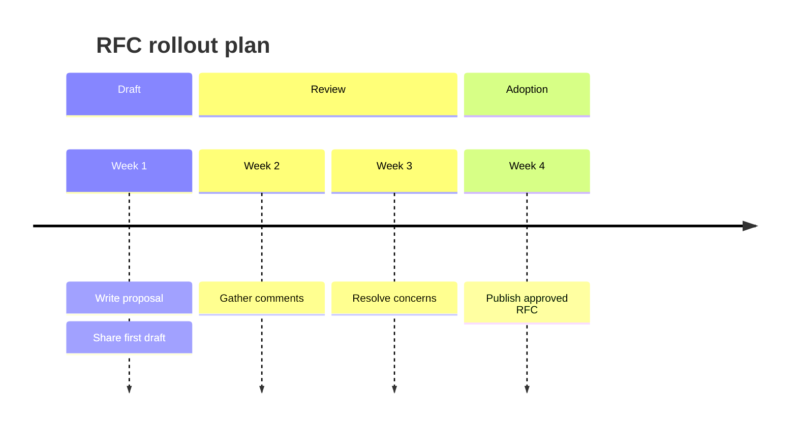
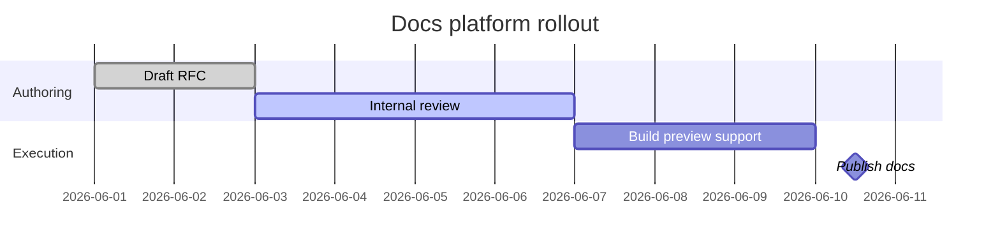

# Mermaid diagram types for tech docs and RFCs

These examples are designed to be copied into Markdown docs, RFCs, ADRs, and architecture notes. Start small, then style.

For most work, this file is enough. Only open the deeper per-type references when you are building a more complex diagram or need exact keyword semantics:

- `flowchart` / `graph` -> `references/flowchart-keywords.md`
- `erDiagram` -> `references/er-keywords.md`
- `gantt` -> `references/gantt-keywords.md`

## 1) Flowchart / graph

Use for system context, component overview, request path, or decision tree.

Notes:
- Great default choice for architecture diagrams.
- Use `subgraph` for trust boundaries, ownership boundaries, or data/control planes.
- Use `classDef` + `class` for semantic grouping.

## 2) Sequence diagram

Use for request lifecycle, review workflow, or cross-service coordination.

Notes:
- Prefer this for time-ordered interactions.
- `box rgba(...)` groups participants by boundary.
- `rect rgba(...)` highlights a phase.

## 3) State diagram

Use for lifecycle docs: document state, deployment state, approval state, or background-job state.

Notes:
- Good for approval or rollout status.
- Use yellow for in-progress states, green for stable/success, red for failure.

## 4) Class diagram

Use for conceptual domain models, services, interfaces, or policy engines.

## 5) ER diagram

Use for schema or persistence design in an RFC.

Notes:
- Keep entity names singular.
- Use cardinality carefully.

## 6) Timeline

Use for pure chronology or phased adoption.

## 7) Gantt

Use for multi-workstream rollout plans.

## Quick chooser

- system overview -> `flowchart`
- ordered interactions -> `sequenceDiagram`
- lifecycle -> `stateDiagram-v2`
- domain model -> `classDiagram`
- schema -> `erDiagram`
- chronology -> `timeline`
- schedule -> `gantt`
