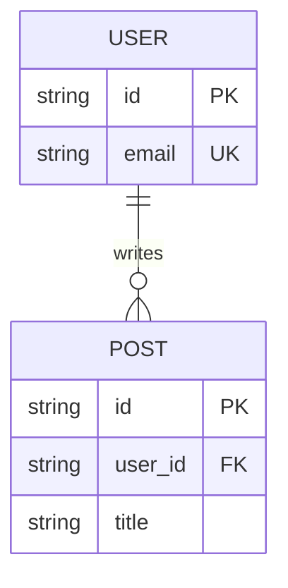
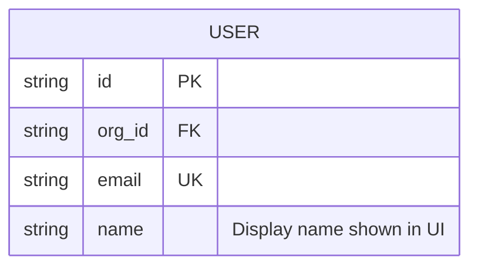

# Mermaid ER diagram keywords and syntax

Use this only when an `erDiagram` is getting complex. For simple schemas, start with `diagram-types.md`.

Based on the official Mermaid ER docs:
- https://mermaid.js.org/syntax/entityRelationshipDiagram.html
- https://mermaid.js.org/intro/syntax-reference.html

## Minimal safe skeleton



## Top-level keywords

- `erDiagram` — declares an entity-relationship diagram.
- `direction TB|BT|LR|RL` — controls layout direction.
- `classDef` — defines reusable styles.
- `class` — applies styles to entities.
- `style` — applies one-off styling to entities.

## Relationship statement format

A relationship line has this structure:

```text
FIRST-ENTITY <left-cardinality><identity><right-cardinality> SECOND-ENTITY : relationship-label
```

Example:

```text
PROPERTY ||--|{ ROOM : contains
```

Meaning:
- `PROPERTY` — first entity.
- `||` — from `PROPERTY` side, exactly one.
- `--` — identifying relationship, drawn solid.
- `|{` — from `ROOM` side, one or more.
- `ROOM` — second entity.
- `contains` — relationship label read from the first entity's perspective.

Only the first entity name is required. The rest of the relationship line is optional as a whole.

## Cardinality markers

The outer symbol expresses the maximum; the inner symbol expresses the minimum.

### Exact symbols

- `||` — exactly one.
- `|o` or `o|` — zero or one.
- `}|` or `|{` — one or more.
- `}o` or `o{` — zero or more.

Read them from each entity toward the other entity.

### Common full relationships

- `USER ||--o{ POST` — one user has zero or many posts; each post belongs to exactly one user.
- `ORDER ||--|{ ORDER_ITEM` — one order has one or many order items.
- `PERSON }o..o{ TEAM` — many-to-many, optional on both sides, non-identifying.

### Text aliases Mermaid also accepts

Mermaid docs list aliases such as:
- `zero or one`
- `one or zero`
- `only one`
- `one or more`
- `one or many`
- `zero or more`
- `zero or many`
- `1`
- `1+`
- `0+`

The symbolic form is safer and easier to scan in docs.

## Identifying vs non-identifying relationships

The center connector describes identity semantics.

- `--` — identifying relationship; solid line.
- `..` — non-identifying relationship; dashed line.
- `to` — alias for `--`.
- `optionally to` — alias for `..`.

Use `--` when the child concept does not meaningfully exist without the parent.
Use `..` when both entities can exist independently.

## Entity blocks and attributes



Inside an entity block:
- first token = attribute type, like `string`, `uuid`, `int`, `timestamp`
- second token = attribute name
- optional key token = `PK`, `FK`, `UK`, or a comma-separated combination like `PK, FK`
- optional quoted comment = rendered annotation for the attribute

### Attribute rules

- Types must start with a letter.
- Types may include digits, hyphens, underscores, parentheses, and square brackets.
- Attribute names follow similar rules.
- An attribute name may start with `*` to indicate a primary key in older ER notation, but `PK` is clearer.
- Mermaid does not enforce a real database type system; the type text is descriptive.

## Entity names and aliases

- Entity names should usually be singular nouns: `USER`, `POST`, `APPROVAL`.
- Names may include spaces if wrapped in double quotes.
- You can show a display alias with square brackets.

Example conceptually:
- internal entity id/name: `ORDER_ITEM`
- displayed alias: `[Order Item]`

Use aliases when the stable identifier should differ from the rendered label.

## Direction and layout

- `direction TB` — top to bottom.
- `direction BT` — bottom to top.
- `direction LR` — left to right.
- `direction RL` — right to left.

`LR` is usually easiest for small logical schemas inside docs.

## Styling keywords

- `classDef data fill:#E0F2FE,stroke:#0369A1,color:#0C4A6E` — reusable style.
- `class USER,POST data` — apply class to entities.
- `style USER fill:#fff,stroke:#333` — one-off style.
- `default` class name — fallback style for unclassified entities.

## Common gotchas

- Keep relationship labels short and from the first entity's perspective.
- Use symbolic cardinalities unless you truly need verbose aliases.
- Do not overstuff attribute blocks; include only fields that help the reader understand the model.
- Decide intentionally whether to show foreign keys; logical models often omit them because relationships already express the association.
- Singular entity names are the clearest default.

## Safe pattern for docs

1. Declare `erDiagram`.
2. Add only entity names and relationships.
3. Verify cardinalities.
4. Add minimal attribute blocks.
5. Add classes/colors only after the structure is clear.
