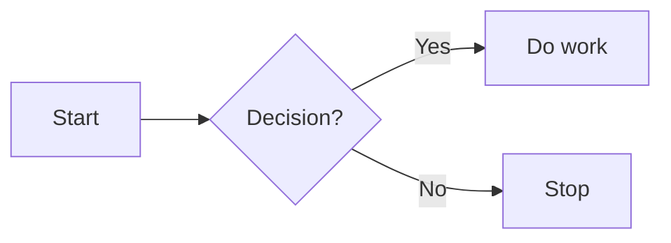
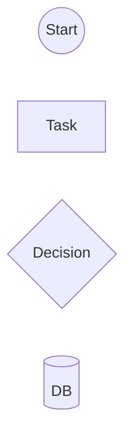
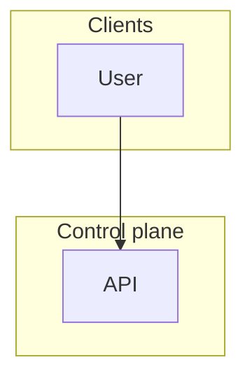

# Mermaid flowchart keywords and syntax

Use this only when a `flowchart` / `graph` diagram is getting complex. For simple diagrams, start with `diagram-types.md`.

Based on the official Mermaid flowchart docs:
- https://mermaid.js.org/syntax/flowchart.html
- https://mermaid.js.org/intro/syntax-reference.html

## Minimal safe skeleton

## Top-level keywords

- `flowchart` — declares a flowchart diagram.
- `graph` — alias for `flowchart`.
- `TB` / `TD` — top to bottom layout.
- `BT` — bottom to top layout.
- `LR` — left to right layout.
- `RL` — right to left layout.
- `subgraph` — starts a grouped region.
- `end` — closes a `subgraph` block.
- `classDef` — defines a reusable visual style.
- `class` — assigns a class to one or more nodes.
- `style` — applies one-off styling to a node.
- `linkStyle` — styles edges by declaration order.
- `click` — adds an interactive callback or URL in Mermaid environments that allow it.
- `%%` — comment line.

## Node syntax

A node has an internal id and an optional label.

- `A` — node id `A`, rendered with label `A`.
- `A["API"]` — id `A`, rendered as a rectangle labeled `API`.
- `A[API]` — same idea, but quotes are safer when punctuation exists.
- Re-using `A` later keeps the previously defined label unless you redefine it.

### Common built-in node shapes

- `A[Text]` — rectangle / process step.
- `A(Text)` — rounded rectangle.
- `A([Text])` — stadium / terminal.
- `A[[Text]]` — subroutine.
- `A[(Text)]` — database / cylinder.
- `A((Text))` — circle.
- `A{Text}` — diamond / decision.
- `A{{Text}}` — hexagon-like prepare shape in older syntax.
- `A[/Text/]` — parallelogram.
- `A[\\Text\\]` — alt parallelogram.
- `A>Text]` or `A[/Text\\]` style variants — older asymmetric shapes; use carefully.

### New generalized shape syntax

Use this when exact semantics matter more than legacy bracket syntax:

Common shape names:
- `rect` — process rectangle
- `rounded` — rounded rectangle
- `stadium` — terminal / pill
- `diam` — decision diamond
- `cyl` — database cylinder
- `circle` / `dbl-circ` — start / stop circles
- `fr-rect` — subprocess
- `doc` — document
- `cloud` — cloud / external system

## Edge syntax

Edges connect nodes.

- `A --> B` — normal directed arrow.
- `A --- B` — undirected/open line.
- `A -.-> B` — dotted arrow.
- `A ===> B` or `A ==> B` — thick arrow.
- `A -->|label| B` — labeled edge.
- `A ---|label| B` — labeled undirected edge.
- `A --> B --> C` — chained edges.
- `A & B --> C` — multiple sources to one target.

### Extra edge meanings

- More dashes make the link span more ranks: `A ----> B`.
- `A ---o B` — circle edge.
- `A ---x B` — cross edge.
- `e1@-->` — attaches id `e1` to an edge so it can be styled later.

## Labels and strings

- Use quoted labels when text contains punctuation or tricky characters.
- Unicode text is allowed.
- Markdown strings can be written with double quotes and backticks when supported.
- Edge labels go between pipes: `-->|Success|`.

## Subgraphs

- `subgraph <id>["Label"]` — starts a named group.
- `end` — closes the group.
- A subgraph may contain its own `direction LR` / `TB` line.
- Official gotcha: if nodes inside a subgraph connect outside it, Mermaid may ignore the subgraph's own direction and inherit the parent direction.

## Styling keywords

- `classDef actor fill:#E0F2FE,stroke:#0369A1,color:#0C4A6E;` — reusable style.
- `class A,B actor;` — apply class `actor` to nodes `A` and `B`.
- `style A fill:#fff,stroke:#333;` — one-off node styling.
- `linkStyle 0 stroke:#DC2626,stroke-width:2px;` — style the first declared edge.
- `linkStyle 1,2 color:blue;` — style multiple edges by index.

Prefer `classDef` + `class` over many `style` statements.

## Common gotchas

- Lowercase `end` as a node label breaks parsing; write `"End"` or `END` instead.
- If a target id starts with lowercase `o` or `x`, Mermaid may treat it as a circle/cross edge marker; add a space or capitalize the id.
- `linkStyle` uses edge declaration order, not node ids.
- Complex one-line chaining is valid, but often harder for humans and models to maintain.
- Keep the first draft structural, then add classes and colors.

## Safe pattern for docs

1. Declare `flowchart` + direction.
2. Define the main nodes with clear labels.
3. Add simple `-->` edges first.
4. Add `subgraph` boundaries.
5. Add edge labels and classes last.
