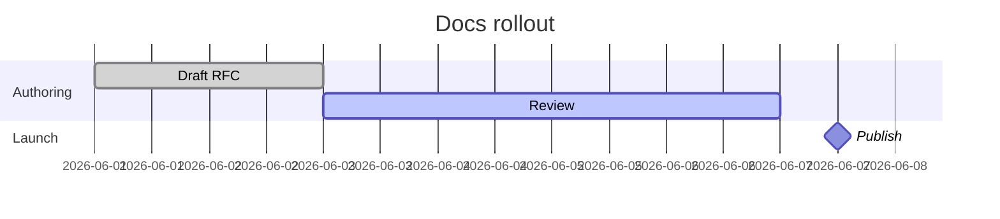
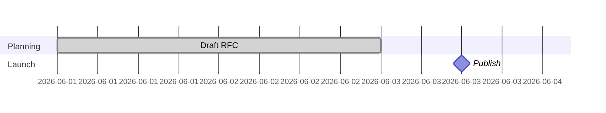

# Mermaid gantt keywords and syntax

Use this only when a `gantt` diagram is getting complex. For simple schedules, start with `diagram-types.md`.

Based on the official Mermaid gantt docs:
- https://mermaid.js.org/syntax/gantt.html
- https://mermaid.js.org/intro/syntax-reference.html

## Minimal safe skeleton



## Top-level keywords

- `gantt` — declares a gantt chart.
- `title` — chart title shown at the top.
- `dateFormat` — how Mermaid should parse input dates in task metadata.
- `axisFormat` — how dates should be rendered on the time axis.
- `tickInterval` — spacing for axis ticks.
- `excludes` — dates or recurring days omitted from duration calculations.
- `weekend` — chooses which two days count as weekends when `excludes weekends` is used.
- `section` — starts a named workstream or lane.

## Task line structure

A task line has this shape:

```text
Task title : metadata
```

The colon `:` separates the visible task label from its metadata.
Metadata items are comma-separated.

## Status / type tags

If present, tags must come first in the metadata list.

- `done` — completed task.
- `active` — in-progress task.
- `crit` — critical task.
- `milestone` — point-in-time milestone instead of a normal duration bar.
- `vert` — vertical reference marker spanning the chart, not a task row.

Tags can be combined when Mermaid supports the combination, but keep usage conservative for docs.

## Task ids and dependencies

A task can optionally have an id so other tasks can refer to it.

```text
Review :active, review, 2026-06-03, 4d
```

Meaning:
- `active` — status tag.
- `review` — task id.
- `2026-06-03` — explicit start date.
- `4d` — duration.

Dependencies use:
- `after review` — start after task id `review` ends.
- `after a b c` — start after the latest ending task among listed ids.
- `until launch` — continue until task `launch` starts.

`until` is useful when a task's end should be tied to another task's start rather than a fixed duration.

## Metadata patterns Mermaid accepts

### 1) Explicit start + duration

```text
Task A :taskA, 2026-06-01, 3d
```

- id = `taskA`
- start = `2026-06-01`
- end = start + `3d`

### 2) Explicit start + explicit end

```text
Task A :taskA, 2026-06-01, 2026-06-04
```

### 3) Dependency + duration

```text
Task B :taskB, after taskA, 4d
```

### 4) Dependency + explicit end

```text
Task B :taskB, after taskA, 2026-06-10
```

### 5) Start + until other task

```text
Support :support, 2026-06-01, until launch
```

### 6) No start date given

If you omit the start date, Mermaid starts the task at the end of the previous task.

## Duration units

Mermaid accepts a number plus a unit suffix.

- `ms` — milliseconds
- `s` — seconds
- `m` — minutes
- `h` — hours
- `d` — days
- `w` — weeks
- `M` — months
- `y` — years

Examples:
- `6h`
- `3d`
- `1.5w`
- `2M`

## Date-related keywords

- `dateFormat YYYY-MM-DD` — parse task dates like `2026-06-15`.
- `axisFormat %Y-%m-%d` — render axis labels using a d3-style time format string.
- `excludes weekends` — skip weekends in duration calculations.
- `excludes 2026-06-19, 2026-06-20` — skip specific dates.
- `excludes sunday` — skip a named weekday.
- `weekend friday` or `weekend saturday` — choose weekend start day when excluding weekends.

Important official behavior:
- excluded days extend a task's finish to preserve the requested duration
- excluded gaps between tasks render as blank time, rather than a bar running through them

## Sections



- `section` creates a named group of tasks.
- Use sections for teams, workstreams, or phases.
- Section titles are required.

## Milestones and vertical markers

- `milestone` — renders as a milestone marker tied to a date/time.
- `vert` — renders a full-height vertical reference line.

Use `milestone` for deliverables and approvals.
Use `vert` for deadlines, freezes, or external events.

## Common gotchas

- `dateFormat` controls parsing, not display; `axisFormat` controls display.
- Task metadata order matters.
- Tags must come before the task id and dates.
- If no explicit start date is given, Mermaid chains from the previous task automatically.
- `excludes` does not create holes inside a task bar; it extends the end date to preserve duration.
- Keep task ids stable and simple if other tasks reference them.

## Safe pattern for docs

1. Declare `gantt`.
2. Add `title` and `dateFormat`.
3. Add `section` lines.
4. Add tasks with explicit ids.
5. Add `after ...` dependencies.
6. Add `axisFormat`, `excludes`, and status tags last.
