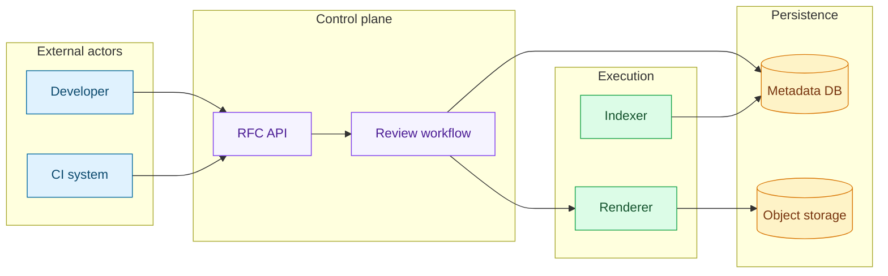
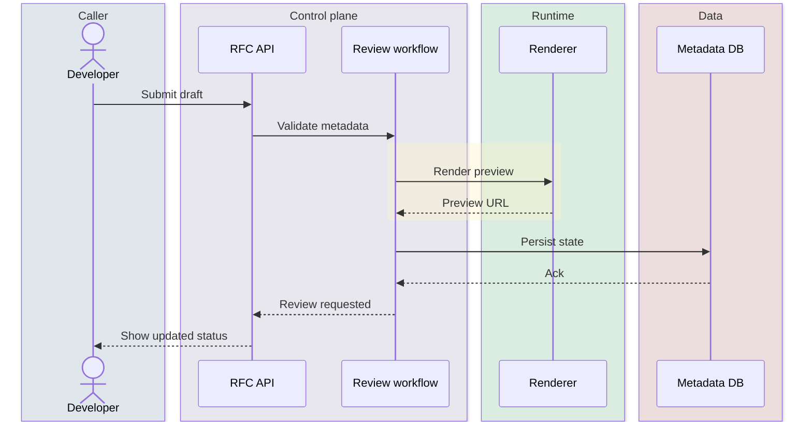
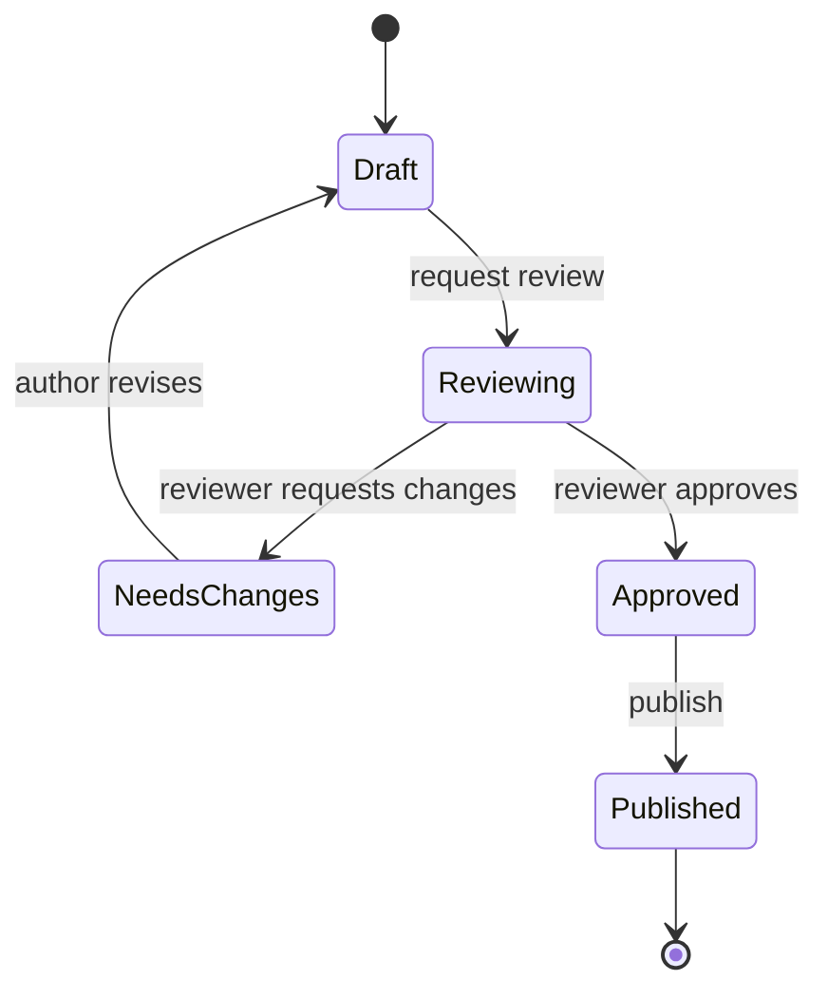
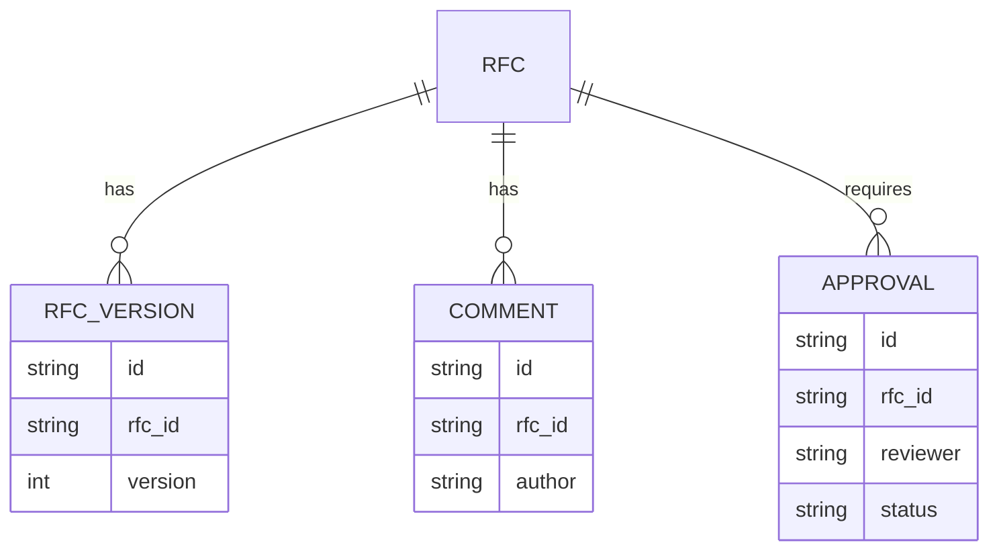
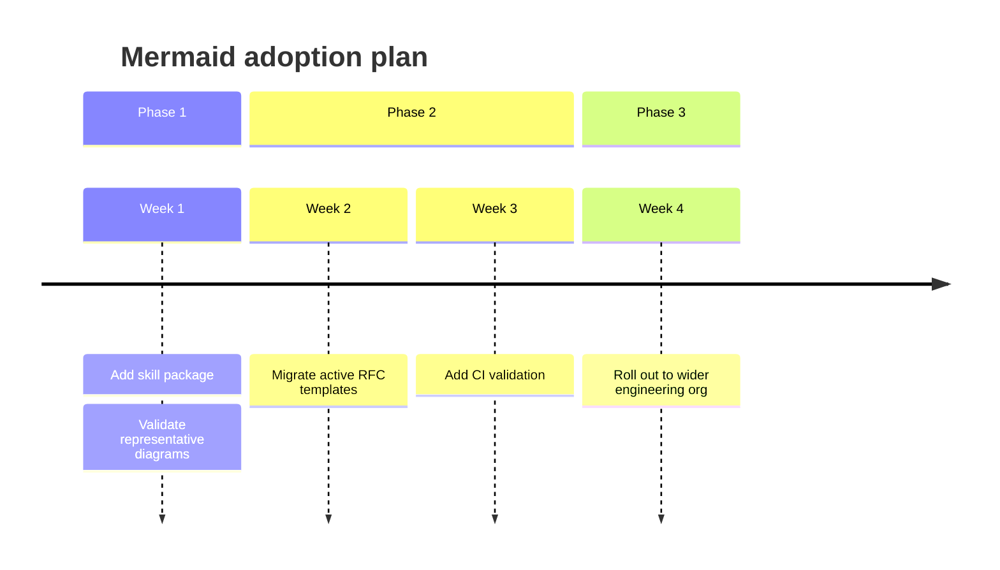

# RFC-friendly Mermaid patterns

These patterns are especially useful in technical docs, architecture docs, ADRs, and RFCs.

## 1) System context with ownership groups

Use when the reader first needs to understand boundaries.

Why it works:
- shows ownership and trust boundaries fast
- uses color semantically instead of decoratively
- works well near the top of an RFC

## 2) Request / control flow

Use when the RFC proposes orchestration logic.

## 3) Lifecycle / state machine

Use when reviewing transitions is the main design risk.

## 4) Data model / approval graph

Use when data ownership and review structure matter.

## 5) Migration / rollout timeline

Use when the RFC describes phased adoption.

## Authoring rules for RFC diagrams

- Prefer one diagram per question. Do not overload a single graphic.
- Put the broadest diagram first, then the deeper ones.
- Keep labels short enough to scan in rendered Markdown.
- Use subgraphs / boxes for ownership, not for decoration.
- If a diagram encodes status, use green/yellow/red consistently across the doc.
- If you need more than ~15 nodes, split the diagram.
